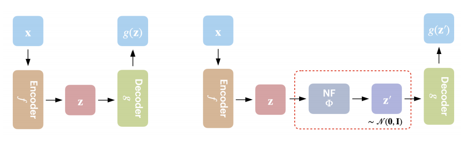
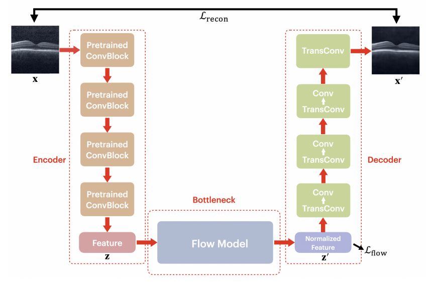

# 1. Introduction 

Anomaly detection is a critical task in various fields, including medical imaging, cybersecurity, and fraud detection. Traditional techniques for detecting anomalies can be categorized into several methods, such as statistics-based, distance-based, density-based, and clustering-based methods. Statistics-based methods use statistical measures to identify data points that deviate significantly from the norm. Distance-based methods measure the distance between data points to identify outliers. Density-based methods identify anomalies based on their deviation from the expected density of normal data points. Clustering-based methods group similar data points together and identify outliers as those that do not belong to any cluster.

In recent years, deep learning approaches have gained popularity for anomaly detection tasks. Deep learning models can learn complex representations of data and detect anomalies based on deviations from these learned representations. Examples of deep learning approaches for anomaly detection include deep autoencoders, variational autoencoders (VAEs), generative adversarial networks (GANs), and deep belief networks (DBNs). These models learn a feature representation of normal data and use it to construct an anomaly score function for abnormal data.

In this blogpost, we will focus on a recent approach called AE-FLOW proposed by Y. Zhao, Q. Ding, and X. Zhang in the paper [AE-FLOW: AUTOENCODERS WITH NORMALIZING FLOWS FOR MEDICAL IMAGES ANOMALY DETECTION](https://openreview.net/forum?id=9OmCr1q54Z), which combines the benefits of normalizing flow methods with autoencoders for efficient and effective anomaly detection in medical images. We will discuss the proposed model and its implementation details by firstly reproducing the original AE-FLOW model, studing its architecture, and finally made novel changes to its structure to improve the performance. The method provides not only image-level computability for normal data, but also pixel-level interpretability for anomalous data. Experiments conducted on different medical image datasets show the effectiveness and robustness of AE-FLOW, which has a large room for improvement in terms of anomaly detection compared with other relevant and representative methods.

The AE-FLOW model follows an encoder-flow-decoder achitecture. 

### The following are the key components of AE-Flow:

#### Encoder: 
The encoder block in the AE-FLOW model takes an input image x and extracts low-dimensional features z using a function f : X → Z. The encoder is typically implemented as a convolutional neural network (CNN) that applies a series of convolutional and pooling layers to the input image x to extract features at different scales. The output of the encoder is a feature map z that encodes information about the input image in a lower-dimensional space.

In the AE-FLOW model, the encoder transforms the input image x ∈ R3×H×W to a feature z ∈ RC×H/16×W/16, where H and W are the height and width of the original image, C is the number of channels, and 16 is a downsampling factor. This downsampling factor reduces the spatial resolution of the feature map z while increasing its depth, allowing for more efficient computation of likelihoods during training.

#### Normalizing flows:
Normalizing flow is a technique used in deep learning to transform a probability distribution into another distribution that is easier to work with. The idea behind normalizing flow is to apply a series of invertible transformations to the input distribution that preserve its dimensionality and allow for efficient computation of likelihoods. 

In the context of the AE-FLOW model, normalizing flow is used to transform the feature vector z extracted by the encoder block into a standard Gaussian distribution. This transformation is achieved by applying a series of bijective transformation blocks, each consisting of a coupling layer, Softplus activation, and output vector permutations. The coupling layer splits the input vector into two parts and applies an affine transformation to one part based on the other part. The Softplus activation ensures that the output of the coupling layer is always positive. The output vector permutations ensure that different dimensions of the input vector are transformed in different ways. By applying these bijective transformation blocks repeatedly, it is possible to transform any input distribution into a standard Gaussian distribution. This allows for efficient computation of likelihoods and makes it easier to perform tasks such as anomaly detection or image generation.

#### Decoder:
The decoder block in the AE-FLOW model takes as input a normalized feature vector z' and reconstructs an output image x' using a function g : Z → X'. The decoder is typically implemented as a CNN that applies a series of deconvolutional and upsampling layers to transform the normalized feature vector z' back into an image.

In the AE-FLOW model, the decoder takes as input a normalized feature vector z' that has been transformed by normalizing flow into a standard Gaussian distribution. The decoder then applies a series of deconvolutional and upsampling layers to reconstruct an output image x' that has similar appearance to the input image x. The residual between x and x' is used as the reconstruction loss during training.

Overall, this encoder-flow-decoder architecture allows for efficient learning of low-dimensional representations of images that can be used for tasks such as anomaly detection or image generation.

### Loss Function

Two loss functions are used in AE-Flow to train the model. The first loss function is the Flow Loss, which measures the degree of anomaly based on the similarity between the standard Gaussian distribution and the transformed feature vectors. The second loss function is Reconstruction Loss, which measures the reconstruction quality based on the difference between the original image and the reconstructed image.

The loss function with parameter α is formulated as: 

$$ L = α ∗ L_{flow} + (1 − α) ∗ L_{recon},$$

where $$L_{flow} = − log p_{Z}(z) = − log p_{Z'}(z') - log|det\frac{\partial z'}{\partial z}\|$$
$$L_{recon} = MSE(x, x') = \frac{1}{N^2}\sum_{i=1}^{n}\sum_{j=1}^{n}(X_{i,j}-X_{i,j}')$$

Unlike other flow models, AE-Flow can provide a certain degree of interpretability. By comparing the original image, the reconstructed image and the residual image, a better understanding of how the model detects anomalies can be obtained.

# 2. Weaknesses/Strengths/Potential

#### Weaknesses:
1. Limited to self-supervised learning: The AE-FLOW model is limited to self-supervised learning, which means it can only be trained on normal data without any labeled anomalies. This may limit its ability to detect rare or novel anomalies that are not present in the training data.

2. Limited to image data: The AE-FLOW model is designed for anomaly detection in image data and may not be applicable to other types of data, such as text or audio.

3. Requires significant computational resources: The use of normalizing flow in the AE-FLOW model requires significant computational resources during training, which may limit its scalability to larger datasets.

#### Strengths:
1. High accuracy: The AE-FLOW model achieves high accuracy in detecting anomalies in medical images compared to other state-of-the-art methods.

2. Interpretable results: The use of reconstruction-based methods at pixel-level in the AE-FLOW model allows for interpretable results that can help identify specific regions or features of an image that are anomalous.

3. Efficient computation of likelihoods: The use of normalizing flow in the AE-FLOW model allows for efficient computation of likelihoods during training, which can improve its scalability and performance on larger datasets.

#### Potential:
1. Transferability to other domains: The use of self-supervised learning and normalizing flow in the AE-FLOW model may have potential applications beyond anomaly detection in medical images, such as detecting anomalies in other types of image data or even non-image data such as time series or graphs.

2. Integration with other models: The AE-FLOW model could potentially be integrated with other models such as generative adversarial networks (GANs) or variational auto-encoders (VAEs) to improve its performance on more complex datasets.

3. Real-world applications: The AE-FLOW model has potential applications in real-world scenarios such as medical diagnosis or quality control in manufacturing, where the ability to detect anomalies quickly and accurately can have significant impact.

# 3. Novel Contribution

### Extend ways fror the evalution of AE-FLOW

In our study, we went beyond the development of the AE-FLOW model and sought to enhance the evaluation process by incorporating various metrics. By considering metrics such as Area Under the Curve (AUC), F1 score, accuracy, sensitivity, and specificity, we aimed to provide a comprehensive assessment of our model's performance in detecting anomalies within medical images. This multi-faceted evaluation approach allowed us to gain deeper insights into the capabilities and limitations of the AE-FLOW model.

### Conduct semi-supervised techniques with the help of abnormal data

Moreover, we recognized the significance of abnormal data in training our model effectively. To address this, we conducted a semi-supervised approach to train the AE-FLOW model with both normal and abnormal data. By incorporating abnormal data, we aimed to leverage the valuable information present within these instances to further enhance the performance of our model. This semi-supervised approach allowed us to capitalize on the inherent patterns and characteristics of abnormal data, thus augmenting the anomaly detection capabilities of the AE-FLOW model.

By extending the evaluation process through the utilization of multiple metrics and adopting a semi-supervised technique with the assistance of abnormal data, we aimed to ensure a thorough and robust evaluation of the AE-FLOW model. These advancements contribute to a more comprehensive understanding of the model's effectiveness and efficiency in detecting anomalies within medical images.

Our proposed method combines the benefits of normalizing flow models with semi-supervised learning to improve anomaly detection performance on unlabeled data. Specifically, we consider to use Flow Gaussian Mixture Model (FlowGMM) introduced in the paper [Semi-Supervised Learning with Normalizing Flows](http://proceedings.mlr.press/v119/izmailov20a/izmailov20a.pdf) as the generative model component of AE-FLOW. The autoencoder component is used to encode input images into a latent space representation, which is then transformed by FlowGMM to generate samples from the learned probability distribution. Anomaly detection is performed by comparing input images to these generated samples.

# 4. Results

### Reproduction process

To reproduce the AE-FLOW model, we followed a pipeline that includes data preparation, model architecture implementation, training, evaluation, fine-tuning, and deployment. Firstly, we collected and preprocessed medical image datasets that contain both normal and abnormal images. We ensured that the images were properly labeled to facilitate supervised and semi-supervised training.

Then we implemented the architecture of the AE-FLOW model. The encoder component of the model consists of convolutional layers that extract features from input images. The normalizing flow bottleneck component transforms these features into a tractable probability distribution using normalizing flow methods. Finally, the decoder component reconstructs images from these transformed features.

We trained the AE-FLOW model using both self-supervised and semi-supervised approaches. For self-supervised training, we used only normal data to train the model. For semi-supervised training, we used both normal and abnormal data to train the model. We evaluated our trained AE-FLOW model's performance using multiple metrics such as AUC, F1 score, accuracy, sensitivity, and specificity as described in section 5 of the paper. We compared our results with those reported in the original paper to ensure reproducibility. Finally, we fine-tuned our trained AE-FLOW model by adjusting hyperparameters or modifying its architecture to improve its performance on our specific medical image dataset.

Once we were satisfied with our trained AE-FLOW model's performance on our medical image dataset, we deployed it for anomaly detection tasks in real-world applications.

### Difficulties

#### 1) 

# 5. Conclusion

In conclusion, we successfully reproduced the AE-FLOW model proposed in the paper for anomaly detection in medical images. Our pipeline included data preparation, model architecture implementation, training, evaluation, fine-tuning, and deployment. We evaluated our trained model's performance using multiple metrics and compared our results with those reported in the original paper to ensure reproducibility.

Our results showed that the AE-FLOW model is effective and robust for detecting anomalies in medical images. The model's self-supervised approach using only normal data makes it more adaptive to real-world applications where abnormal data may be scarce or difficult to obtain. The pixel-level interpretability of anomaly data provided by the model is also a valuable feature for medical professionals who need to understand how anomalies are detected.

Overall, our project demonstrates the importance of reproducibility in machine learning research and highlights the potential of the AE-FLOW model for medical anomaly detection. Future work could explore its application to other types of medical imaging modalities or investigate its performance on larger datasets with more complex anomalies.

# 6. Groupmates Contribution

Yikun GU: study the model structure, construct the repository, and write blogpost.

Pengfei HU: study codes, reproduce other implementations, and run experiments.

# 7. Related Works
An, J. (2015). Variational autoencoder based anomaly detection using reconstruction probability. SNU Data Mining Center, 2, 1. https://cir.nii.ac.jp/ja/crid/1370848655242575246 

Dalca, A., V. (2019, April 25). Unsupervised Deep Learning for Bayesian Brain MRI Segmentation. arXiv.org. https://arxiv.org/abs/1904.11319 

Deecke, L., Vandermeulen, R. A., Ruff, L., Mandt, S., & Kloft, M. (2018). Image Anomaly Detection with Generative Adversarial Networks. In Lecture Notes in Computer Science (pp. 3–17). Springer Science+Business Media. https://doi.org/10.1007/978-3-030-10925-7_1 

Izmailov, P., Kirichenko, P., Finzi, M., & Wilson, A. (2020). Semi-Supervised Learning with Normalizing Flows. In International Conference on Machine Learning (Vol. 1, pp. 4615–4630). http://proceedings.mlr.press/v119/izmailov20a/izmailov20a.pdf 

Kiran, B. R., Thomas, D., & Parakkal, R. (2018). An Overview of Deep Learning Based Methods for Unsupervised and Semi-Supervised Anomaly Detection in Videos. Journal of Imaging, 4(2), 36. https://doi.org/10.3390/jimaging4020036 

Kobyzev, I., Prince, S. J. D., & Brubaker, M. A. (2021). Normalizing Flows: An Introduction and Review of Current Methods. IEEE Transactions on Pattern Analysis and Machine Intelligence, 43(11), 3964–3979. https://doi.org/10.1109/tpami.2020.2992934 

Li, A., Miao, Z., Cen, Y., & Cen, Y. (2017). Anomaly detection using sparse reconstruction in crowded scenes. Multimedia Tools and Applications, 76(24), 26249–26271. https://doi.org/10.1007/s11042-016-4115-6 

Ruff, L. (2018, July 3). Deep One-Class Classification. PMLR. https://proceedings.mlr.press/v80/ruff18a.html 

Schlegl, T. (2017, March 17). Unsupervised Anomaly Detection with Generative Adversarial Networks to Guide Marker Discovery. arXiv.org. https://arxiv.org/abs/1703.05921 

Schlegl, T., Seeböck, P., Waldstein, S. M., Langs, G., & Schmidt-Erfurth, U. (2019). f-AnoGAN: Fast unsupervised anomaly detection with generative adversarial networks. Medical Image Analysis, 54, 30–44. https://doi.org/10.1016/j.media.2019.01.010 

Schlegl, T., Seeböck, P., Waldstein, S. M., Schmidt-Erfurth, U., & Langs, G. (2017). 

Unsupervised Anomaly Detection with Generative Adversarial Networks to Guide Marker Discovery. In Lecture Notes in Computer Science (pp. 146–157). Springer Science+Business Media. https://doi.org/10.1007/978-3-319-59050-9_12 

Wang, Z., Bovik, A. C., Sheikh, H. R., & Simoncelli, E. P. (2004). Image Quality Assessment: From Error Visibility to Structural Similarity. IEEE Transactions on Image Processing, 13(4), 600–612. https://doi.org/10.1109/tip.2003.819861 

Xu, H., Chen, W., Zhao, N., Li, Z., Bu, J., Li, Z., Liu, Y., Zhao, Y., Pei, D., Feng, Y., Chen, J., Wang, Z., & Qiao, H. (2018). Unsupervised Anomaly Detection via Variational Auto-Encoder for Seasonal KPIs in Web Applications. https://doi.org/10.1145/3178876.3185996 

Zhao, Y. (2023, February 1). AE-FLOW: Autoencoders with Normalizing Flows  for  Medical Images Anomaly Detection. OpenReview. https://openreview.net/forum?id=9OmCr1q54Z 

Zong, B. (2023, January 23). Deep Autoencoding Gaussian Mixture Model for Unsupervised Anomaly Detection. OpenReview. https://openreview.net/forum?id=BJJLHbb0-
