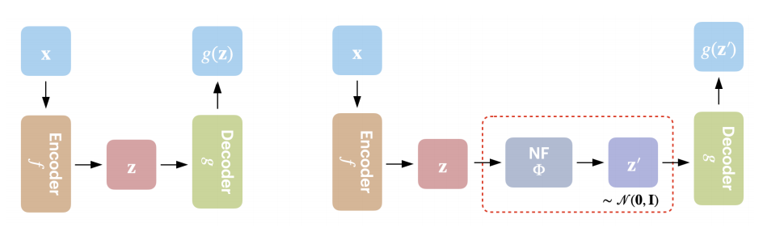
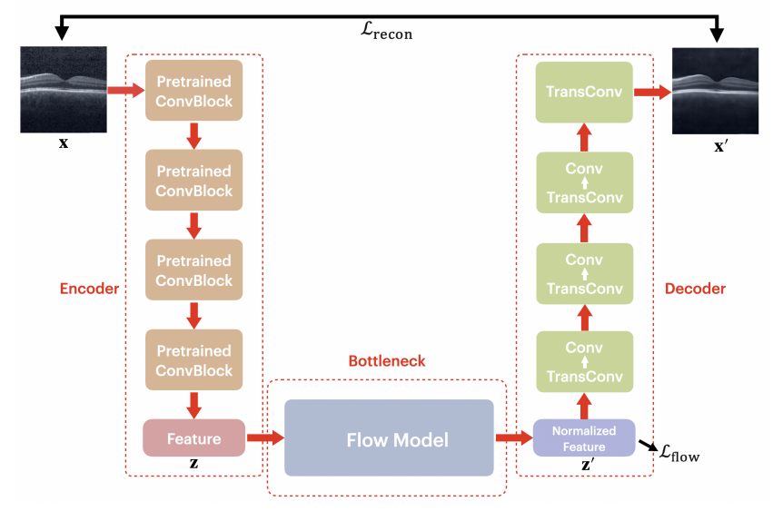

# 1. Introduction 

AE-Flow is a method proposed by Y. Zhao, Q. Ding, and X. Zhang in the paper [AE-FLOW: AUTOENCODERS WITH NORMALIZING FLOWS FOR MEDICAL IMAGES ANOMALY DETECTION](https://openreview.net/forum?id=9OmCr1q54Z), and is used for anomaly detection in medical images. It combines autoencoder and a normalizing flow bottleneck to improve the accuracy and interpretability of anomaly detection. The method provides not only image-level computability for normal data, but also pixel-level interpretability for anomalous data. Experiments conducted on different medical image datasets show the effectiveness and robustness of AE-FLOW, which has a large room for improvement in terms of anomaly detection compared with other relevant and representative methods. In this project, we firstly reproduce the original AE-FLOW model, studied its architecture, and finally made novel changes to its structure to improve the performance.

The AE-FLOW model follows an encoder-flow-decoder achitecture. 

### The following are the key components of AE-Flow:

#### Encoder: 
The encoder block in the AE-FLOW model takes an input image x and extracts low-dimensional features z using a function f : X → Z. The encoder is typically implemented as a convolutional neural network (CNN) that applies a series of convolutional and pooling layers to the input image x to extract features at different scales. The output of the encoder is a feature map z that encodes information about the input image in a lower-dimensional space.

In the AE-FLOW model, the encoder transforms the input image x ∈ R3×H×W to a feature z ∈ RC×H/16×W/16, where H and W are the height and width of the original image, C is the number of channels, and 16 is a downsampling factor. This downsampling factor reduces the spatial resolution of the feature map z while increasing its depth, allowing for more efficient computation of likelihoods during training.

#### Normalizing flows:
Normalizing flow is a technique used in deep learning to transform a probability distribution into another distribution that is easier to work with. The idea behind normalizing flow is to apply a series of invertible transformations to the input distribution that preserve its dimensionality and allow for efficient computation of likelihoods. 

In the context of the AE-FLOW model, normalizing flow is used to transform the feature vector z extracted by the encoder block into a standard Gaussian distribution. This transformation is achieved by applying a series of bijective transformation blocks, each consisting of a coupling layer, Softplus activation, and output vector permutations. The coupling layer splits the input vector into two parts and applies an affine transformation to one part based on the other part. The Softplus activation ensures that the output of the coupling layer is always positive. The output vector permutations ensure that different dimensions of the input vector are transformed in different ways. By applying these bijective transformation blocks repeatedly, it is possible to transform any input distribution into a standard Gaussian distribution. This allows for efficient computation of likelihoods and makes it easier to perform tasks such as anomaly detection or image generation.

#### Decoder:
The decoder block in the AE-FLOW model takes as input a normalized feature vector z' and reconstructs an output image x' using a function g : Z → X'. The decoder is typically implemented as a CNN that applies a series of deconvolutional and upsampling layers to transform the normalized feature vector z' back into an image.

In the AE-FLOW model, the decoder takes as input a normalized feature vector z' that has been transformed by normalizing flow into a standard Gaussian distribution. The decoder then applies a series of deconvolutional and upsampling layers to reconstruct an output image x' that has similar appearance to the input image x. The residual between x and x' is used as the reconstruction loss during training.

Overall, this encoder-flow-decoder architecture allows for efficient learning of low-dimensional representations of images that can be used for tasks such as anomaly detection or image generation.

### Loss Function

Two loss functions are used in AE-Flow to train the model. The first loss function is the Flow Loss, which measures the degree of anomaly based on the similarity between the standard Gaussian distribution and the transformed feature vectors. The second loss function is Reconstruction Loss, which measures the reconstruction quality based on the difference between the original image and the reconstructed image.

The loss function with parameter α is formulated as: $L = α ∗ L_{flow} + (1 − α) ∗ L_{recon}$,

where $L_{flow} = − log p_{Z}(z) = − log p_{Z'}(z') - log|det\frac{\partial z'}{\partial z}\|$

Unlike other flow models, AE-Flow can provide a certain degree of interpretability. By comparing the original image, the reconstructed image and the residual image, a better understanding of how the model detects anomalies can be obtained.

### Related Works

1. "Unsupervised Anomaly Detection with Generative Adversarial Networks to Guide Marker Discovery" by Schlegl et al. (2017).

2. "Unsupervised Anomaly Detection via Variational Auto-Encoder for Seasonal KPIs in Web Applications" by Xu et al. (2018).

3. "Deep One-Class Classification" by Ruff et al. (2018).

4. "Variational Autoencoder based Anomaly Detection using Reconstruction Probability" by An and Cho (2015).

5. "Deep Autoencoding Gaussian Mixture Model for Unsupervised Anomaly Detection" by Zong et al. (2018).

6. "Image Anomaly Detection with Generative Adversarial Networks" by  L. Deecke et al. (2018).

7. "Unsupervised Deep Learning for Bayesian Brain MRI Segmentation" by Dalca et el. (2018).

# 2. Weaknesses/Strengths/Potential

#### Weaknesses:
1. Limited to self-supervised learning: The AE-FLOW model is limited to self-supervised learning, which means it can only be trained on normal data without any labeled anomalies. This may limit its ability to detect rare or novel anomalies that are not present in the training data.

2. Limited to image data: The AE-FLOW model is designed for anomaly detection in image data and may not be applicable to other types of data, such as text or audio.

3. Requires significant computational resources: The use of normalizing flow in the AE-FLOW model requires significant computational resources during training, which may limit its scalability to larger datasets.

#### Strengths:
1. High accuracy: The AE-FLOW model achieves high accuracy in detecting anomalies in medical images compared to other state-of-the-art methods.

2. Interpretable results: The use of reconstruction-based methods at pixel-level in the AE-FLOW model allows for interpretable results that can help identify specific regions or features of an image that are anomalous.

3. Efficient computation of likelihoods: The use of normalizing flow in the AE-FLOW model allows for efficient computation of likelihoods during training, which can improve its scalability and performance on larger datasets.

#### Potential:
1. Transferability to other domains: The use of self-supervised learning and normalizing flow in the AE-FLOW model may have potential applications beyond anomaly detection in medical images, such as detecting anomalies in other types of image data or even non-image data such as time series or graphs.

2. Integration with other models: The AE-FLOW model could potentially be integrated with other models such as generative adversarial networks (GANs) or variational auto-encoders (VAEs) to improve its performance on more complex datasets.

3. Real-world applications: The AE-FLOW model has potential applications in real-world scenarios such as medical diagnosis or quality control in manufacturing, where the ability to detect anomalies quickly and accurately can have significant impact.

# 3. Novel Contribution

# 4. Results

# 5. Conclusion

# 6. Groupmates Contribution

Yikun GU: study the model structure, construct the repository, and write blogpost.

Pengfei HU: study codes, reproduce other implementations, and run experiments.
